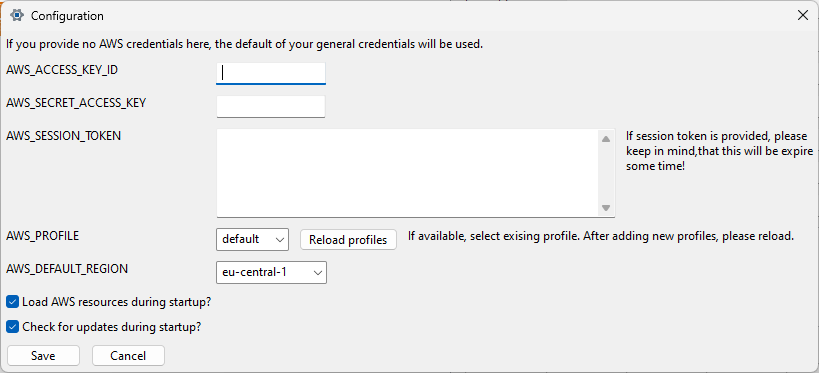
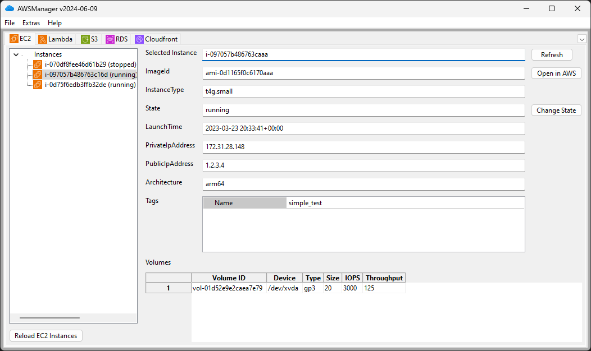
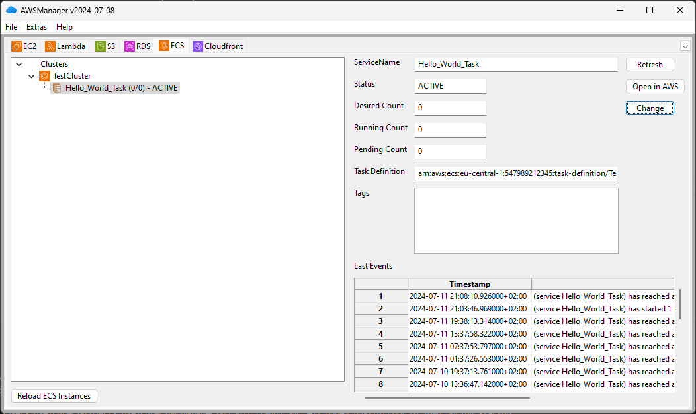

# AWSManager

With **AWS Manager**, you manage your resources and services within Amazon Web Services (AWS). At the same time, you keep an overview of all running services. It is also possible to start and stop the services. I have tried to display the essential information. You can access detailed information about each instance via a direct link to the AWS Management Console.

See current Freeware version (deprecated) of AWSManager at [dseichter.de](https://www.dseichter.de/aws-manager/).


## Supported AWS Servies

| AWS Service | Functions in AWS Manager |
| ----------- | ------------------------ |
| [Amazon EC2](https://aws.amazon.com/ec2/?nc1=h_ls) | Query general information<br>Starting and stopping an EC2 instance<br>Calling the EC2 instance directly in AWS Management Console |
| [Amazon ECS](https://aws.amazon.com/ecs/?nc1=h_ls) | Query general information<br>Listing of all available services<br>Change the desired number of services<br>Direct invocation of services in AWS Management Console |
| [Amazon RDS](https://aws.amazon.com/rds/?nc1=h_ls) | Query general information<br>Starting and stopping an RDS instance<br>Calling the RDS instance directly in AWS Management Console |
| [AWS Lambda](https://aws.amazon.com/lambda/?nc1=h_ls) | Query general information<br>Execution of a Lambda function with transfer payload<br>Direct call of Lambda function in AWS Management Console |
| [Amazon S3](https://aws.amazon.com/s3/?nc1=h_ls) | Query all objects within an S3 bucket<br>Download, upload and delete objects<br>Browse to the S3 bucket in AWS Management Console |
| [Amazon Cloudfront](https://aws.amazon.com/cloudfront/?nc1=h_ls) | Query general information<br>Running Invalidate Cache<br>Direct invocation of Cloudfront Distribution in AWS Management Console.<br>See and open Cloudfront functions|

## Installation

The installation is very simple. Save the downloaded file in a destination folder of your choice and start the program. At startup a configuration file will be created in the same directory. The configuration windows can be found within the menu Extras.

 "AWS Manager - Configuration")

## Services

### EC2

List all of your EC2 instances. Select an instance and the details will be reloaded from your AWS account. Currently you can start or stop each instance.



### Amazon ECS

Get an overview of your Amazon ECS clusters. For each cluster, all services configured for it are loaded. For each service in the cluster, change the number of instances you want. We use this feature to manually start or stop systems that we rarely need.



### AWS Lambda

Get an overview of your Lambda functions. See the most important configurations of your functions. Also the environment variables are visible. Since version 1.2 you can also execute a Lambda function directly. To execute a Lambda function, select the “Invoke” button.


### Amazon S3

List all your S3 buckets. By selecting the corresponding S3 bucket, you will get an overview of all objects. Select an object, and you can download it with the download button.


### Amazon Cloudfront CDN

Get a complete overview of all Cloudfront distributions within your account. Additionally, you can invalidate the existing cache without logging into the Management Console.


### further services

More services will be implemented. Check the **open issues** or create a new one, if you miss anything.

# Contributing

If you want to contribute by fixing an issue, add a new function or just optimize something, a simple instruction how to start development.

## Start development

Create and activate an environment by running the following command:

```python -m venv .venv```

```.venv/Scripts/activate```

Install the required dependencies

```pip install -r src/requirements.txt```

If you want to do some UI changes, download and install the latest wxFormBuilder from the [wxFormBuilder Homepage](https://github.com/wxFormBuilder/wxFormBuilder).


