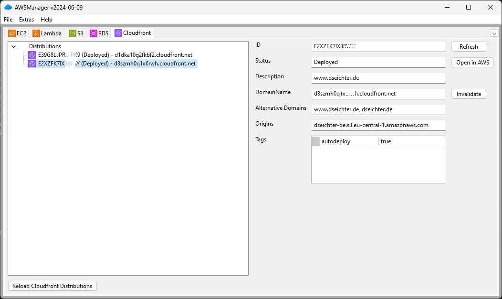

# AWSManager

Manage resources and services on AWS. See current Freeware version of AWSManager at [dseichter.de](https://www.dseichter.de/aws-manager/).

## First images

The first impressions of the upcoming rewritten AWS Manager:




## Badges


## Start development

Create and activate an environment by running the following command:

```python -m venv .venv```

```.venv/Scripts/activate```

Install the required dependencies

```pip install -r src/requirements.txt```

If you want to do some UI changes, download and install the latest wxFormBuilder from the [wxFormBuilder Homepage](https://github.com/wxFormBuilder/wxFormBuilder).

